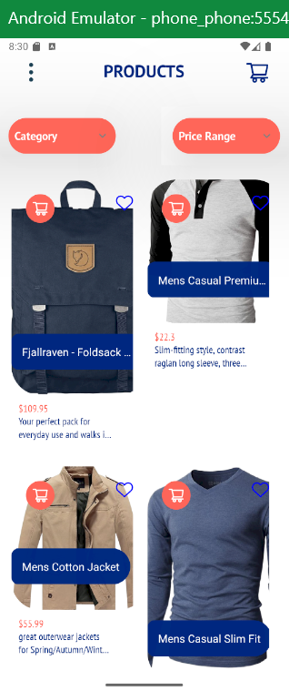
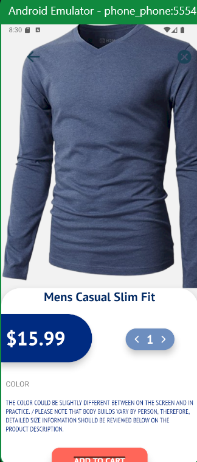
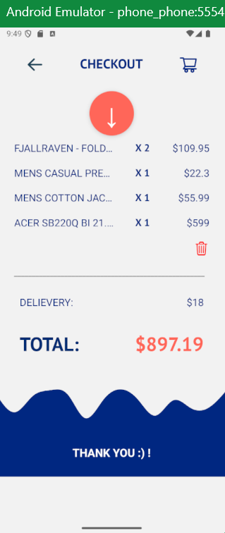
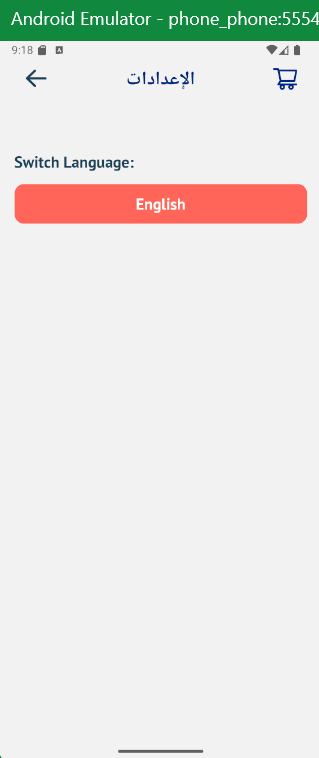
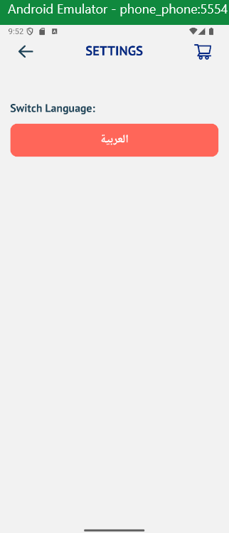
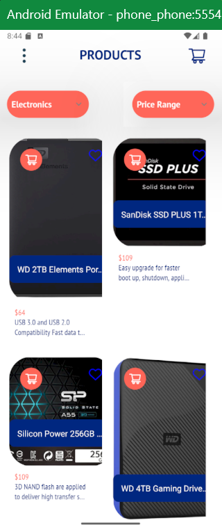
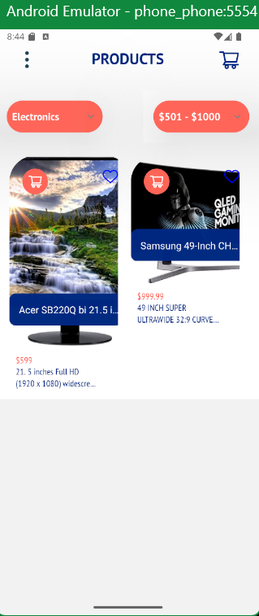

# React Native Challenge - Mobile Development
This project was developed as a part of a Mobile Development Challenge.
### The goal is to build an application that replicates given UI screens, integrating SQLite for local storage, uses external APIs and offers support for both Arabic and English Languages.

## Features: 
- Three Screens replicating the UI and one for language support.
- Use of Navigation with React Navigation
- Local Data Storage by integrating SQLite
- Localization and Language support provided by (i18n)
- Filtering Products Based on Category and Price

## Project Structure: 
src/    
├── components/     
├── constants/      
├── context/        
├── functions/      
├── language/       
├── screens/        
├── services/       
├── style/          
└── App.js          

## Tech Stack:
- Git/GitHub
- React Native
- React Navigation (react-navigation/native)
- SQLite (expo-sqlite)
- Localization (react-i18next)

## Screenshots: 
### Home Screen

### Details Screen

### Checkout Screen

### Settings Screen

### Filtering Logic

